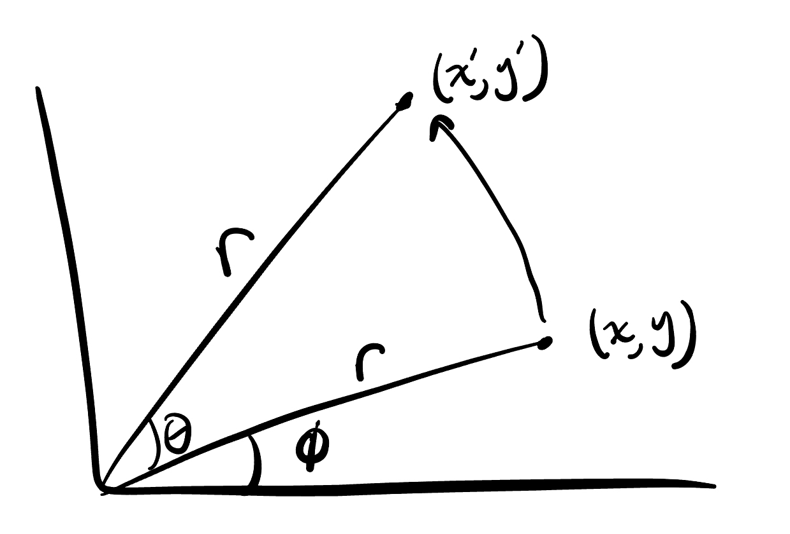

## 2D Rotation Matrix Derivation

We start with a vector $\mathbf{v}$ on the Cartesian plan at coordinates $(x, y)$ which we rotate by an angle $\theta$ to our transformed point $\mathbf{v'}$ at $(x', y')$.

We want our $2\times 2$ rotation matrix to be a function of theta such that 
$$\begin{bmatrix}a & b \\ c & d\end{bmatrix}
\begin{bmatrix}x \\ y\end{bmatrix} = \begin{bmatrix}x' \\ y'\end{bmatrix}$$

Or equivalently, 

$$\mathbf{R(\theta)v} = \mathbf{v'}$$

How can we go about solving for $a, b, c, d$? 

We can introduce another angle $\phi$ as the angle between the $x$-axis and $\mathbf{v}$ and represent $\mathbf{v}$ in polar coordinates. This is because polar coordinates already use angular rotations, so when we want to get $\mathbf{v'}$, we keep $\mathbf{v}$\'s magnitude $r$ and just add $\theta$ to the angle of our polar vector.

Here is a picture of our current setup:

<!--  -->

With 

$$\mathbf{v} = (r \cos(\phi), r \sin(\phi))$$
$$\mathbf{v'} = (r \cos(\phi+\theta), r \sin(\phi+\theta))$$

Then

$$\begin{bmatrix}a & b \\ c & d\end{bmatrix}
\begin{bmatrix}r \cos(\phi) \\ r \sin(\phi)\end{bmatrix} = \begin{bmatrix}r \cos(\phi+\theta) \\ r \sin(\phi+\theta)\end{bmatrix}$$

And multiplying out we get

$$ar\cos(\phi) + b r \sin(\phi) = r \cos(\phi+\theta)$$

$$c r\cos(\phi) + d r \sin(\phi) = r \sin(\phi+\theta)$$

Now using the angle addition identity, we can expand the RHS to get

$$ar\cos(\phi) + b r \sin(\phi) = r (\cos(\theta)\cos(\phi) - \sin(\theta)\sin(\phi))$$

$$c r\cos(\phi) + d r \sin(\phi) = r (\sin(\theta)\cos(\phi) + \cos(\theta)\sin(\phi))$$

Factoring out the $r$\'s,

$$a\cos(\phi) + b \sin(\phi) = \cos(\theta)\cos(\phi) - \sin(\theta)\sin(\phi)$$

$$c \cos(\phi) + d \sin(\phi) = \sin(\theta)\cos(\phi) + \cos(\theta)\sin(\phi)$$

And by simple examination we can now see

$$a=\cos(\theta)$$

$$b=-\sin(\theta)$$

$$c=\sin(\theta)$$

$$d=\cos(\theta)$$

Therefore,

$$\mathbf{R(\theta)} = \begin{bmatrix}\cos(\theta) & -\sin(\theta) \\ \sin(\theta) & \cos(\theta)\end{bmatrix}$$

We now have a matrix to rotate any 2D vector by an angle $\theta$! Getting this matrix is very simple and straightforward, the key insight is to switch to polar form with an initial angle $\phi$, and then apply the angle addition identity that of course nobody remembers on the spot.

$$\square$$